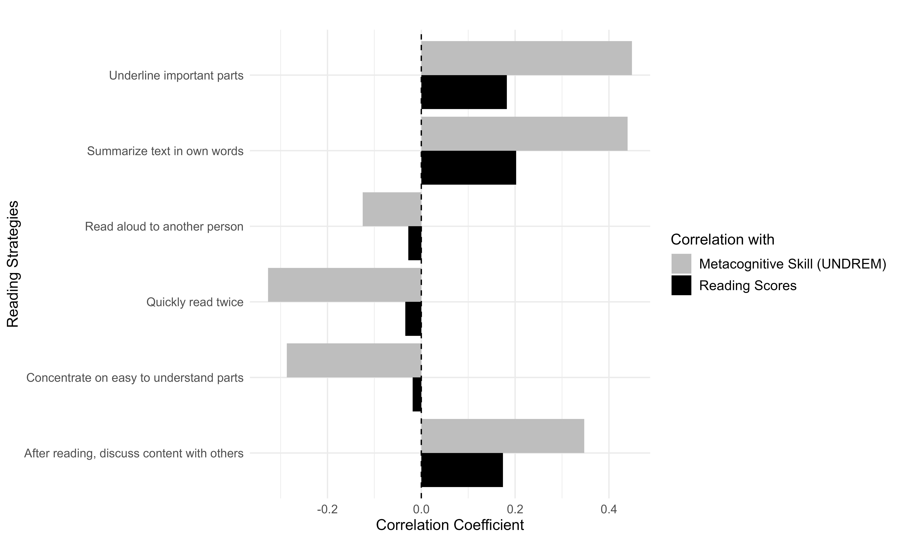
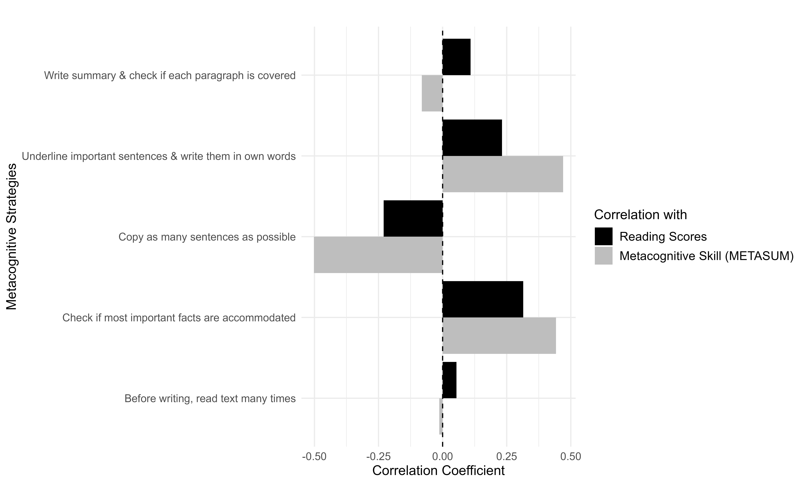
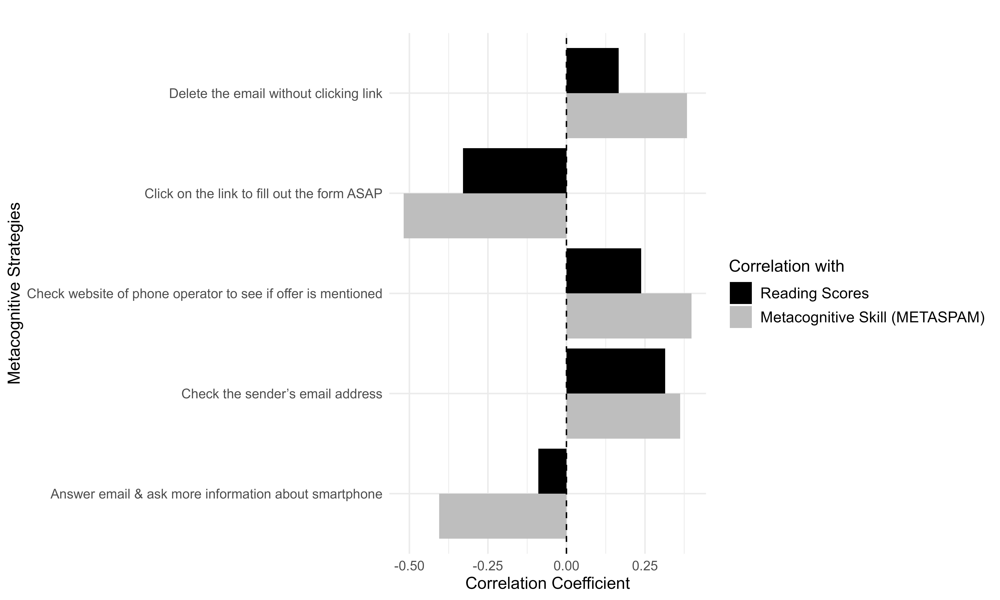

```{r setup, include=FALSE}
knitr::opts_chunk$set(echo = TRUE,
                      comment = NA,
                      warning = FALSE,
                      message = FALSE,
                      tidy = 'styler',
                      error = FALSE, 
                      highlight = TRUE, 
                      prompt = FALSE)
library(haven)
library(ggplot2)
library(tidyverse)
library(dplyr)
library(janitor)
library(purrr)
library(survey)
library(broom)
```

## 1. Understanding Data Structure
#### i. Data Dimension and Variables in the Dataset
```{r data, echo=FALSE}
# Define the file path
  #file_path <- "C:/Users/ghimiren/Desktop/PISA_USA/pisa_2024/CY07_MSU_STU_QQQ_long.sav"

# Read the .sav file
  meta_read_data <- read_sav("meta_read_data.sav")

# View the dimension of the data
dim(meta_read_data)
names(meta_read_data)

# Subset Data Metacognitive Variables and Reading Data
#meta_read_data <- large_data %>%
  #select(CNTRYID, CNTSCHID, CNTSTUID, ST164Q01IA, ST164Q02IA, ST164Q03IA, ST164Q04IA, ST164Q05IA, ST164Q06IA, ST165Q01IA, ST165Q02IA, ST165Q03IA, ST165Q04IA, ST165Q05IA, ST166Q01HA, ST166Q02HA, ST166Q03HA, ST166Q04HA,ST166Q05HA, UNDREM, METASUM, METASPAM, W_FSTUWT, PV1READ, PV2READ, PV3READ, PV4READ, PV5READ, PV6READ, PV7READ,PV8READ, PV9READ, PV10READ)

# Saving the data as a .sav file
  #rm(large_data)
  #write_sav(meta_read_data, "meta_read_data.sav")
```

```{r missing_data, include=FALSE}
# Checking Missing Data
  #meta_read_data %>% 
    #select(UNDREM, METASUM, METASPAM) %>% 
    #summarise_all(funs(sum(is.na(.))))
  
  summary(is.na(meta_read_data))
```

#### ii. Descriptive Statistics
```{r desc_stats, echo=FALSE}
# Subset Data for Descriptive Data
descriptive_data <- meta_read_data %>%
  select(ST164Q01IA, ST164Q02IA, ST164Q03IA, ST164Q04IA, ST164Q05IA, ST164Q06IA, ST165Q01IA, ST165Q02IA, ST165Q03IA, ST165Q04IA, ST165Q05IA, ST166Q01HA, ST166Q02HA, ST166Q03HA, ST166Q04HA,ST166Q05HA, UNDREM, METASUM, METASPAM)
#str(descriptive_data)

# Calculate descriptive statistics
desc_stats <- descriptive_data %>%
  summarise(across(everything(), list(mean = ~mean(., na.rm = TRUE), 
                                      sd = ~sd(., na.rm = TRUE), 
                                      min = ~min(., na.rm = TRUE), 
                                      max = ~max(., na.rm = TRUE))))

# Make the data long, so each row is a variable-statistic combination
desc_stats_long <- desc_stats %>%
  pivot_longer(cols = everything(), names_to = "variable_statistic", values_to = "value") %>%
  separate(variable_statistic, into = c("variable", "statistic"), sep = "_", extra = "merge") %>%
  pivot_wider(names_from = statistic, values_from = value)

# View the more readable statistics table
print(desc_stats_long)
summary(descriptive_data)
```

#### iii. Correlation Matrix
```{r corr_matrix, echo=FALSE}
# Calculate correlation matrix and p-values
cor_matrix <- cor(descriptive_data, use = "pairwise.complete.obs")
cor_matrix <- round(cor_matrix, 3)
cor_matrix
```

### 2. Creating Survey Design and Analyzing Effective Sample Size
```{r pv1read}
options(scipen = 999)
# Define the survey design with the weights
design <- svydesign(ids = ~1, data = meta_read_data, weights = ~W_FSTUWT)
summary(design)
weights_vector <- weights(design)

# Calculate effective sample size for a variable
effsize <- sum(weights_vector)^2 / sum(weights_vector^2)
effsize
```

In this study, data were analyzed from a total sample of 612,004 participants. Given the complex survey design, individual responses were weighted to account for variability in representation across the study population. The weighting process adjusts for over- or under-representation of specific segments within the sample, ensuring that our estimates more accurately reflect the target population (Gard et al., 2023). To quantify the impact of these survey weights on our analysis, we calculated the effective sample size, which considers the distribution of the survey weights and their contribution to the variance of our estimates.

The effective sample size was determined to be approximately 92,778, a figure representing the equivalent number of equally weighted observations necessary to achieve a similar level of precision in our estimates. This discrepancy between the total and effective sample sizes underscores the significance of the survey weights in our analysis, indicating that, due to the weighted survey design, the actual amount of independent information available for analysis is akin to having 92,778 equally weighted observations (Heeringa et al., 2017).

### 3. Sampling with PV1READ Model
When dealing with plausible values like those in the PISA dataset, averaging them isn't generally recommended. This is because plausible values aren't "missing data imputed" but are drawn from a posterior distribution of proficiency, given the test data. Averaging them could result in misleading inference.

To address this, the OECD's method for analyzing plausible values is to run the analyses separately for each plausible value and then average the results of those analyses. This approach retains the variance within each plausible value.

The use of sampling weights is essential in survey data analysis, as it ensures that the sample is representative of the target population. These weights, like W_FSTUWT in PISA, account for the complex sampling design, oversampling, and non-response.

For a weighted multiple regression in R, we could use the survey package. Here's an example of how we might structure your analysis for one plausible value (PV1READ):

```{r pv1read_model, echo=FALSE}
options(scipen = 999)
# Run the regression model for PV1READ
model1 <- svyglm(PV1READ ~ UNDREM + METASUM + METASPAM, design = design)

# Summary of the model
summary(model1)
```

The output shown is a summary of the weighted linear regression model you've fit using the **svyglm** function from the survey package. This model predicts `PV1READ` (a plausible value of reading score) based on three predictor variables: `UNDREM`, `METASUM`, and `METASPAM`. Here's how to interpret the output:

The Estimate column provides the coefficients of PV1 model. The intercept, 472.2776, is the expected value of PV1READ when all predictor variables are 0. The other estimates tell us how a one-unit change in the corresponding predictor variable is associated with a change in the PV1READ score, assuming all other variables are held constant.

- For UNDREM, an increase by 1 unit is associated with an increase in PV1READ by 16.5291 units.
- For METASUM, an increase by 1 unit is associated with an increase in PV1READ by 23.9883 units.
- For METASPAM, an increase by 1 unit is associated with an increase in PV1READ by 37.4345 units.

The Dispersion parameter for the Gaussian family is the estimated scale parameter, equivalent to the estimated variance of the errors in a classical linear regression model. In this case, the dispersion parameter is 8332.086. It's important to note that this is an absolute measure, and its interpretation depends on the scale of our outcome variable (PV1READ). The root of the dispersion parameter can give us an estimate of the average absolute deviation (which, in our case, would be the square root of 8332.086), which is ~ 91.28.

## 4. Modeling Weighted Survey Generalized Linear Models
### A. Predicting Reading Scores by Meta-Cognitive Reading Skills
#### i. Full Model
```{r metacognitive_skill_reading_model, echo=FALSE} 
# List of plausible values
plausible_vars <- paste0("PV", 1:10, "READ")

# Run the model for each plausible value, get coefficients
meta_read <- map(plausible_vars, ~ {
  svyglm(as.formula(paste(.x, "~ UNDREM + METASUM + METASPAM")), design = design)
})

# Extract coefficients and standard errors
meta_read_coefs_ses <- map(meta_read, ~ {
  data.frame(term = names(coef(.x)),
             estimate = coef(.x),
             std.error = sqrt(diag(vcov(.x))))
})

# Calculate p-values based on the estimates and standard errors
# Assuming a normal distribution, which might require adjustments for specific context
meta_read_coefs_pvals <- map(meta_read_coefs_ses, ~ mutate(.x, p.value = 2 * pnorm(-abs(estimate / std.error))))

# Combine and calculate the average of coefficients, standard errors, and p-values for each predictor across all models
meta_read_average_coefs_pvals <- bind_rows(meta_read_coefs_pvals) %>%
  group_by(term) %>%
  summarise(average_estimate = mean(estimate, na.rm = TRUE),
            average_std_error = mean(std.error, na.rm = TRUE),
            average_p_value = mean(p.value, na.rm = TRUE))

# Print the average coefficients, standard errors, and p-values
print(meta_read_average_coefs_pvals)
```

#### ii. Null Model
```{r null_model_all_reading, echo=FALSE}
# Fitting a null model
meta_read_null_model <- map(plausible_vars, ~ {
  svyglm(as.formula(paste(.x, "~ 1")), design = design)
})

# Calculating the average coefficients for the null model
meta_read_null_coefs <- map_dfr(meta_read_null_model, ~ data.frame(term = names(coef(.x)),
                                                                 estimate = coef(.x)))
average_null_coefs <- meta_read_null_coefs %>%
  group_by(term) %>%
  summarise(average_estimate = mean(estimate, na.rm = TRUE))

# Print the average coefficients for the null model
print(average_null_coefs)
```

#### iii. Model Comparison
```{r model_comparison_reading, echo=FALSE}
# Compare the composite model with the null model
anova(meta_read_null_model[[1]], meta_read[[1]], test = "Chisq")
```

### B. Predicting Reading Scores by Reading Strategies
#### i . Full Model 
```{r reading_strategies_reading_model, echo=FALSE}
# Run the model for each plausible value and get detailed summaries
reading_model_all_vars <- map(plausible_vars, ~ {
  formula_str <- paste(.x, "~ ST164Q01IA + ST164Q02IA + ST164Q03IA + ST164Q04IA + ST164Q05IA + ST164Q06IA + ST165Q01IA + ST165Q02IA + ST165Q03IA + ST165Q04IA + ST165Q05IA + ST166Q01HA + ST166Q02HA + ST166Q03HA + ST166Q04HA + ST166Q05HA")
  model_read <- svyglm(as.formula(formula_str), design = design)
  summary_df <- summary(model_read)$coefficients
  
  # Convert to data frame and add term names as a column
  summary_df <- as.data.frame(summary_df)
  summary_df$term <- row.names(summary_df)
  return(summary_df)
})

# using map_dfr directly which should preserve the term names correctly
reading_model_all_vars_df <- map_dfr(reading_model_all_vars, ~ .x)

# Calculate the mean of coefficients, standard errors, t values, and p values for each term
reading_model_all_vars_average_results <- reading_model_all_vars_df %>%
  group_by(term) %>%
  summarise(across(c(Estimate, `Std. Error`, `t value`, `Pr(>|t|)`), mean, na.rm = TRUE))

# View the average results
print(reading_model_all_vars_average_results)
```

#### ii. UNDREM Variables and Reading Scores Model
```{r undrem_reading_strategies_score, echo=FALSE}
# Run the model for each plausible value and get detailed summaries
undrem_reading_score_model <- map(plausible_vars, ~ {
  formula_str <- paste(.x, "~ ST164Q01IA + ST164Q02IA + ST164Q03IA + ST164Q04IA + ST164Q05IA + ST164Q06IA")
  model_read <- svyglm(as.formula(formula_str), design = design)
  summary_df <- summary(model_read)$coefficients
  
  # Convert to data frame and add term names as a column
  summary_df <- as.data.frame(summary_df)
  summary_df$term <- row.names(summary_df)
  return(summary_df)
})

# Using map_dfr directly which should preserve the term names correctly
undrem_reading_score_model_df <- map_dfr(undrem_reading_score_model, ~ .x)

# Calculate the mean of coefficients, standard errors, t values, and p values for each term
undrem_reading_score_average_results <- undrem_reading_score_model_df %>%
  group_by(term) %>%
  summarise(across(c(Estimate, `Std. Error`, `t value`, `Pr(>|t|)`), mean, na.rm = TRUE))

# View the average results
print(undrem_reading_score_average_results)
```

#### iii. METASUM Variables and Reading Scores Model
```{r metasum_reading_strategies_score, echo=FALSE}
# Run the model for each plausible value and get detailed summaries
metasum_reading_score_model <- map(plausible_vars, ~ {
  formula_str <- paste(.x, "~ ST165Q01IA + ST165Q02IA + ST165Q03IA + ST165Q04IA + ST165Q05IA")
  model_read <- svyglm(as.formula(formula_str), design = design)
  summary_df <- summary(model_read)$coefficients
  
  # Convert to data frame and add term names as a column
  summary_df <- as.data.frame(summary_df)
  summary_df$term <- row.names(summary_df)
  return(summary_df)
})

# Using map_dfr directly which should preserve the term names correctly
metasum_reading_score_model_df <- map_dfr(metasum_reading_score_model, ~ .x)

# Calculate the mean of coefficients, standard errors, t values, and p values for each term
metasum_reading_score_average_results <- metasum_reading_score_model_df %>%
  group_by(term) %>%
  summarise(across(c(Estimate, `Std. Error`, `t value`, `Pr(>|t|)`), mean, na.rm = TRUE))

# View the average results
print(metasum_reading_score_average_results)
```

#### iv. METASPAM Variables and Reading Scores Model
```{r metaspam_reading_strategies_score, echo=FALSE}
# Run the model for each plausible value and get detailed summaries
metaspam_reading_score_model <- map(plausible_vars, ~ {
  formula_str <- paste(.x, "~ ST166Q01HA + ST166Q02HA + ST166Q03HA + ST166Q04HA + ST166Q05HA")
  model_read <- svyglm(as.formula(formula_str), design = design)
  summary_df <- summary(model_read)$coefficients
  
  # Convert to data frame and add term names as a column
  summary_df <- as.data.frame(summary_df)
  summary_df$term <- row.names(summary_df)
  return(summary_df)
})

# Using map_dfr directly which should preserve the term names correctly
metaspam_reading_score_model_df <- map_dfr(metaspam_reading_score_model, ~ .x)

# Calculate the mean of coefficients, standard errors, t values, and p values for each term
metaspam_reading_score_average_results <- metaspam_reading_score_model_df %>%
  group_by(term) %>%
  summarise(across(c(Estimate, `Std. Error`, `t value`, `Pr(>|t|)`), mean, na.rm = TRUE))

# View the average results
print(metaspam_reading_score_average_results)
```

### C. Metacognitive Skill Models
#### i. Predicting Understanding and Remembering Using Associated Reading Strategies
```{r undrem_meta_strategies, echo=FALSE}
undrem_model <- svyglm(UNDREM ~ ST164Q01IA + ST164Q02IA + ST164Q03IA + ST164Q04IA + ST164Q05IA + ST164Q06IA, design = design)
summary(undrem_model)
# Getting the R-squared value
rsq_undrem <- 1 - undrem_model$deviance / undrem_model$null.deviance
cat(sprintf("The R-squared value for the undrem_model is %.3f", rsq_undrem))
```

#### ii. Metacognitive Awareness of Summarizing 
```{r metasum_meta_strategies, echo=FALSE}
metasum_model <- svyglm(METASUM ~ ST165Q01IA + ST165Q02IA + ST165Q03IA + ST165Q04IA + ST165Q05IA,design = design)
summary(metasum_model)
# Getting the R-squared value
rsq_metasum <- 1 - metasum_model$deviance / metasum_model$null.deviance
cat(sprintf("The R-squared value for the undrem_model is %.3f", rsq_metasum))
```

#### iii. Metacognitive Awareness of Assessing Credibility 
```{r metaspam_meta_strategies, echo=FALSE}
metaspam_model <- svyglm(METASPAM ~ ST166Q01HA + ST166Q02HA + ST166Q03HA + ST166Q04HA + ST166Q05HA, design = design)
summary(metaspam_model)
# Getting the R-squared value
rsq_metaspam <- 1 - metaspam_model$deviance / metaspam_model$null.deviance
cat(sprintf("The R-squared value for the undrem_model is %.3f", rsq_metaspam))
```

## 5. Pairwise Correlation Analysis
### A. UNDREM vs. Reading Strategies and Reading Scores
  - *UNDREM* = "Metacognitive awareness of understanding and remembering";
  - *ST164Q01IA* = "I concentrate on the parts of the text that are easy to understand";
  - *ST164Q02IA* = "I quickly read through the text twice";
  - *ST164Q03IA* = "After reading the text, I discuss its content with other people";
  - *ST164Q04IA* = "I underline important parts of the text";
  - *ST164Q05IA* = "I summarize the text in my own words";
  - *ST164Q06IA* = "I read the text aloud to another person",

#### i. UNDREM vs. Reading Strategies
```{r pairwise_correlation_undrem_strategies, echo=FALSE}
windowsFonts(MyFont = windowsFont("Arial"))

# UNDREM predictors
variables_undrem <- c("ST164Q01IA", "ST164Q02IA", "ST164Q03IA", "ST164Q04IA", "ST164Q05IA", "ST164Q06IA")

# Loop through each variable and perform cor.test with UNDREM
for (var in variables_undrem) {
  test_result <- cor.test(meta_read_data$UNDREM, meta_read_data[[var]], use = "complete.obs")
  cat("UNDREM ~", var, ": Correlation =", test_result$estimate, "p-value =", test_result$p.value, "\n")
}
```

#### ii. Reading Strategies Vs. Reading Scores
```{r pairwise_correlation_strategies_scores, echo=FALSE}
# Correlation between variables_undrem and pv1read-pv10read
# Calculate Average Correlation
cor_undrem_read <- sapply(variables_undrem, function(var) {
  correlation_undrem <- sapply(1:10, function(i) {
    cor.test(meta_read_data[[var]], meta_read_data[[paste0("PV", i, "READ")]], use = "complete.obs")$estimate
  })
  mean(correlation_undrem, na.rm = TRUE)
})
cor_undrem_read
```

#### iii. Plotting the Correlations for UNDREM
```{r plot_correlation_undrem, echo=FALSE}
# Creating Correlation table for UNDREM
undrem_data_descriptive <- data.frame(
  description_undrem = c("Concentrate on easy to understand parts",
                  "Quickly read twice",
                  "After reading, discuss content with others",
                  "Underline important parts",
                  "Summarize text in own words",
                  "Read aloud to another person"),
  Correlation_undrem = c(-0.2867328, -0.3266454, 0.3472629, 0.4490406, 0.4396146, -0.1247665),
  Correlation_read = c(-0.01833729, -0.03404063,  0.17417845,  0.18238375,  0.20229358, -0.02774301)
)

# Add an identifier for each correlation type
undrem_data_descriptive$Type <- "UNDREM"

# Create a similar data frame for reading scores correlations
read_data_descriptive_undrem <- undrem_data_descriptive %>%
  select(description_undrem, Correlation_read) %>%
  rename(Correlation_undrem = Correlation_read) %>%
  mutate(Type = "Read")

# Combine both data frames
combined_data_undrem <- bind_rows(undrem_data_descriptive, read_data_descriptive_undrem)

# Adjusting for APA 7 style
undrem_plot <- ggplot(combined_data_undrem, aes(x = description_undrem, y = Correlation_undrem, fill = Type)) +
  geom_bar(stat = "identity", position = "dodge") +
  coord_flip() +
  theme_minimal(base_family = "Arial") +
  theme(text = element_text(size = 12, family = "Arial"),
        axis.title = element_text(size = 12),
        legend.title = element_text(size = 12),
        legend.text = element_text(size = 11),
        plot.title = element_text(size = 14, face = "bold")) +
  scale_fill_manual(values = c("UNDREM" = "grey", "Read" = "black"),
                    name = "Correlation with",
                    labels = c("UNDREM" = "Metacognitive Skill (UNDREM)", "Read" = "Reading Scores")) +
  labs(title = "",
       x = "Reading Strategies",
       y = "Correlation Coefficient") +
  geom_hline(yintercept = 0, linetype = "dashed", color = "black") +
  guides(fill = guide_legend(reverse = TRUE))
#undrem_plot

# Show the plot
ggsave("Figure 1. Correlation between Metacognitive Reading Strategies and UNDREM.jpeg", plot = undrem_plot, width = 10, height = 6, units = "in", dpi = 600)
```



### B. METASUM vs. Reading Strategies and Reading Scores
  - *METASUM* = "Metacognitive awareness of summarizing";
  - *ST165Q01IA* = "I write a summary. Then I check that each paragraph is covered in the summary, because the content of each paragraph should be included";
  - *ST165Q02IA* = "I try to copy out accurately as many sentences as possible";
  - *ST165Q03IA* = "Before writing the summary, I read the text as many times as possible";
  - *ST165Q04IA* = "I carefully check whether the most important facts in the text are represented in the summary";
  - *ST165Q05IA* = "I read through the text, underlining the most important sentences. Then I write them in my own words as a summary";

#### i. METASUM vs. Reading Strategies
```{r pairwise_correlation_metasum_strategies, echo=FALSE}
# METASUM predictors
variables_metasum <- c("ST165Q01IA", "ST165Q02IA", "ST165Q03IA", "ST165Q04IA", "ST165Q05IA")

# Loop through each variable and perform cor.test with METASUM
for (var in variables_metasum) {
  test_result <- cor.test(meta_read_data$METASUM, meta_read_data[[var]], use = "complete.obs")
  cat("METASUM ~", var, ": Correlation =", test_result$estimate, "p-value =", test_result$p.value, "\n")
}
```

#### ii. METASUM vs. Reading Scores
```{r pairwise_correlation_metasum_scores, echo=FALSE}  
# Correlation between variables_metasum and pv1read-pv10read
# Calculate Average Correlation with Reading Scores
cor_metasum_read <- sapply(variables_metasum, function(var) {
  correlation_metasum <- sapply(1:10, function(i) {
    # Ensure this line correctly calculates the correlation between the METASUM variable and each reading score
    cor.test(meta_read_data[[var]], meta_read_data[[paste0("PV", i, "READ")]], use = "complete.obs")$estimate
  })
  mean(correlation_metasum, na.rm = TRUE)
})
cor_metasum_read
```

#### iii. Plotting the Correlations for METASUM
```{r plot_correlation_metasum, echo=FALSE}
# Creating Correlation table for METASUM
metasum_data_descriptive <- data.frame(
  description_metasum = c("Write summary & check if each paragraph is covered",
                  "Copy as many sentences as possible",
                  "Before writing, read text many times",
                  "Check if most important facts are accommodated",
                  "Underline important sentences & write them in own words"),
  Correlation_metasum = c(-0.08107716, -0.5021068, -0.01311923, 0.4421182, 0.4701468),
  Correlation_read = c(0.10879998, -0.22987239, 0.05402973, 0.31454011, 0.23178539)
)

# Add an identifier for each correlation type
metasum_data_descriptive$Type <- "METASUM"

# Create a similar data frame for reading scores correlations
read_data_descriptive_metasum <- metasum_data_descriptive %>%
  select(description_metasum, Correlation_read) %>%
  rename(Correlation_metasum = Correlation_read) %>%
  mutate(Type = "Read")

# Combine both data frames
combined_data_metasum <- bind_rows(metasum_data_descriptive, read_data_descriptive_metasum)

# Adjusting for APA 7 style
metasum_plot <- ggplot(combined_data_metasum, aes(x = description_metasum, y = Correlation_metasum, fill = Type)) +
  geom_bar(stat = "identity", position = "dodge") +
  coord_flip() +
  theme_minimal(base_family = "Arial") +
  theme(text = element_text(size = 12, family = "Arial"),
        axis.title = element_text(size = 12),
        legend.title = element_text(size = 12),
        legend.text = element_text(size = 11),
        plot.title = element_text(size = 14, face = "bold")) +
  scale_fill_manual(values = c("METASUM" = "grey", "Read" = "black"),
                    name = "Correlation with",
                    labels = c("METASUM" = "Metacognitive Skill (METASUM)", "Read" = "Reading Scores")) +
  labs(title = "",
       x = "Metacognitive Strategies",
       y = "Correlation Coefficient") +
  geom_hline(yintercept = 0, linetype = "dashed", color = "black") +
  guides(fill = guide_legend(reverse = TRUE))
#metasum_plot

# Save the plot
ggsave("Figure 2. Correlation between Metacognitive Reading Strategies and METASUM.jpeg", plot = metasum_plot, width = 10, height = 6, units = "in", dpi = 600)
```



### C. METASPAM vs. Reading Strategies and Reading Scores
  - *METASPAM* = "Metacognitive awareness of assessing credibility";
  - *ST166Q01HA* = "Answer the email and ask for more information about the smartphone";
  - *ST166Q02HA* = "Check the sender’s email address";
  - *ST166Q03HA* = "Click on the link to fill out the form as soon as possible";
  - *ST166Q04HA* = "Delete the email without clicking on the link";
  - *ST166Q05HA* = "Check the website of the mobile phone operator to see whether the smartphone offer is mentioned"

#### i. METASPAM vs. Reading Strategies
```{r pairwise_correlation_metaspm_strategies, echo=FALSE}
# METASPAM predictors
variables_metaspm <- c("ST166Q01HA", "ST166Q02HA", "ST166Q03HA", "ST166Q04HA", "ST166Q05HA")

# Loop through each variable and perform cor.test with METASPAM
for (var in variables_metaspm) {
  test_result <- cor.test(meta_read_data$METASPAM, meta_read_data[[var]], use = "complete.obs")
  cat("METASPAM ~", var, ": Correlation =", test_result$estimate, "p-value =", test_result$p.value, "\n")
}
```

#### ii. METASPAM vs. Reading Scores
```{r pairwise_correlation_metaspm_scores, echo=FALSE}
# Correlation between variables_metaspm and pv1read-pv10read
# Calculate Average Correlation with Reading Scores
cor_metaspm_read <- sapply(variables_metaspm, function(var) {
  correlation_metaspm <- sapply(1:10, function(i) {
    # Ensure this line correctly calculates the correlation between the METASPAM variable and each reading score
    cor.test(meta_read_data[[var]], meta_read_data[[paste0("PV", i, "READ")]], use = "complete.obs")$estimate
  })
  mean(correlation_metaspm, na.rm = TRUE)
})
cor_metaspm_read
```

#### iii. Plotting the Correlations for METASPAM
```{r plot_correlation_metaspm, echo=FALSE}
# Creating Correlation table for METASPAM
metaspam_data_descriptive <- data.frame(
  description_metaspm = c("Answer email & ask more information about smartphone",
                  "Check the sender’s email address",
                  "Click on the link to fill out the form ASAP",
                  "Delete the email without clicking link",
                  "Check website of phone operator to see if offer is mentioned"),
  Correlation_metaspm = c(-0.4050722, 0.3620675, -0.5179707, 0.3835217, 0.3983277),
  Correlation_read = c(-0.08965924, 0.31437917, -0.32927337, 0.16644737, 0.23787345)
)

# Add an identifier for each correlation type
metaspam_data_descriptive$Type <- "METASPAM"

# Create a similar data frame for reading scores correlations
read_data_descriptive_metaspam <- metaspam_data_descriptive %>%
  select(description_metaspm, Correlation_read) %>%
  rename(Correlation_metaspm = Correlation_read) %>%
  mutate(Type = "Read")

# Combine both data frames
combined_data_metaspam <- bind_rows(metaspam_data_descriptive, read_data_descriptive_metaspam)

# Adjusting for APA 7 style
metaspam_plot <- ggplot(combined_data_metaspam, aes(x = description_metaspm, y = Correlation_metaspm, fill = Type)) +
  geom_bar(stat = "identity", position = "dodge") +
  coord_flip() +
  theme_minimal(base_family = "Arial") +
  theme(text = element_text(size = 12, family = "Arial"),
        axis.title = element_text(size = 12),
        legend.title = element_text(size = 12),
        legend.text = element_text(size = 11),
        plot.title = element_text(size = 14, face = "bold")) +
  scale_fill_manual(values = c("METASPAM" = "grey", "Read" = "black"),
                    name = "Correlation with",
                    labels = c("METASPAM" = "Metacognitive Skill (METASPAM)", "Read" = "Reading Scores")) +
  labs(title = "",
       x = "Metacognitive Strategies",
       y = "Correlation Coefficient") +
  geom_hline(yintercept = 0, linetype = "dashed", color = "black") +
  guides(fill = guide_legend(reverse = TRUE))
#metaspam_plot

# Save the plot
ggsave("Figure 3. Correlation between Metacognitive Reading Strategies and METASPAM.jpeg", plot = metaspam_plot, width = 10, height = 6, units = "in", dpi = 600)
```



### D. Metacognitive Reading Skills and Reading Scores
```{r metacognitive_reading_skills_vs_scores, echo=FALSE}
# Correlation between metacognitive reading skills and reading scores
# METASPAM predictors
variables_metacognition <- c("UNDREM", "METASUM", "METASPAM")

# Calculate Average Correlation with Reading Scores
cor_metacognition_read <- sapply(variables_metacognition, function(var) {
  correlation_metacognition <- sapply(1:10, function(i) {
    # Ensure this line correctly calculates the correlation between the METASPAM variable and each reading score
    cor.test(meta_read_data[[var]], meta_read_data[[paste0("PV", i, "READ")]], use = "complete.obs")$estimate
  })
  mean(correlation_metacognition, na.rm = TRUE)
})
cor_metacognition_read
```

## 6. Decomposition of Categorical Variables Regression Models
### A. Metacognition Skill Models
#### i. Understanding and Remembering
```{r undrem_reg, echo=FALSE}
undrem_data <- meta_read_data %>%
  select(CNTRYID, CNTSCHID, CNTSTUID, ST164Q01IA, ST164Q02IA, ST164Q03IA, ST164Q04IA, ST164Q05IA, ST164Q06IA, UNDREM, W_FSTUWT, PV1READ, PV2READ, PV3READ, PV4READ, PV5READ, PV6READ, PV7READ,PV8READ, PV9READ, PV10READ) %>%
  mutate(across(c(ST164Q01IA, ST164Q02IA, ST164Q03IA, ST164Q04IA, ST164Q05IA, ST164Q06IA), factor))

undrem_cat_model <- lm(UNDREM ~ ST164Q01IA + ST164Q02IA + ST164Q03IA + ST164Q04IA + ST164Q05IA + ST164Q06IA, data = undrem_data)
summary(undrem_cat_model)
```

#### ii. Summarizing
```{r metasum_reg, echo=FALSE}
metasum_data <- meta_read_data %>%
  select(CNTRYID, CNTSCHID, CNTSTUID, ST165Q01IA, ST165Q02IA, ST165Q03IA, ST165Q04IA, ST165Q05IA, METASUM, W_FSTUWT, PV1READ, PV2READ, PV3READ, PV4READ, PV5READ, PV6READ, PV7READ,PV8READ, PV9READ, PV10READ) %>%
  mutate(across(c(ST165Q01IA, ST165Q02IA, ST165Q03IA, ST165Q04IA, ST165Q05IA), factor))

metasum_cat_model <- lm(METASUM ~ ST165Q01IA + ST165Q02IA + ST165Q03IA + ST165Q04IA + ST165Q05IA, data = metasum_data)
summary(metasum_cat_model)
```

#### iii. Assessing Credibility
```{r metaspm_reg, echo=FALSE}
metaspm_data <- meta_read_data %>%
  select(CNTRYID, CNTSCHID, CNTSTUID, ST166Q01HA, ST166Q02HA, ST166Q03HA, ST166Q04HA, ST166Q05HA, METASPAM, W_FSTUWT, PV1READ, PV2READ, PV3READ, PV4READ, PV5READ, PV6READ, PV7READ,PV8READ, PV9READ, PV10READ) %>%
  mutate(across(c(ST166Q01HA, ST166Q02HA, ST166Q03HA, ST166Q04HA, ST166Q05HA), factor))

metaspm_cat_model <- lm(METASPAM ~ ST166Q01HA + ST166Q02HA + ST166Q03HA + ST166Q04HA + ST166Q05HA, data = metaspm_data)
summary(metaspm_cat_model)
```

### B. Reading Scores Model  
#### i. Understanding and Remembering
```{r read_cat_reg, echo=FALSE, cache=TRUE}
# the model
undrem_read_model <- map(plausible_vars, ~ {
  undrem_cat_model <- lm(as.formula(paste(.x, "~ ST164Q01IA + ST164Q02IA + ST164Q03IA + ST164Q04IA + ST164Q05IA + ST164Q06IA")), data = undrem_data, design = design)
  undrem_cat_model
})

# Compute the mean and standard error of the coefficients
average_undrem_cat_coefs <- map_df(undrem_read_model, broom::tidy, conf.int = TRUE) %>%
  group_by(term) %>%
 summarise(estimate = round(mean(estimate, na.rm = TRUE),2), 
            std.error = round(mean(std.error, na.rm = TRUE), 2),
            conf.low = round(mean(conf.low, na.rm = TRUE), 2),
            conf.high = round(mean(conf.high, na.rm = TRUE), 2),
            p.value = round(mean(p.value, na.rm = TRUE), 4))

data.frame(average_undrem_cat_coefs)

# R-squared
undrem_read_r <- map_dbl(undrem_read_model, ~ summary(.x)$r.squared) %>% mean()
cat(sprintf("The R-squared value for the UNDREM Read model is %.3f", undrem_read_r))

# Sample size used for the model
undrem_read_sample <- map_dbl(undrem_read_model, ~ nobs(.x))
cat(sprintf("The average sample size used for the UNDREM Read model is %.0f", mean(undrem_read_sample)))
```

#### ii. Reading Model - Summarizing
```{r sum_cat_reg, echo=FALSE, cache=TRUE}
# the model
metasum_read_model <- map(plausible_vars, ~ {
  metasum_cat_model <- lm(as.formula(paste(.x, "~ ST165Q01IA + ST165Q02IA + ST165Q03IA + ST165Q04IA + ST165Q05IA")), data = metasum_data)
  metasum_cat_model
})

# Compute the mean and standard error of the coefficients, including the mean p-value
average_metasum_cat_coefs <- map_df(metasum_read_model, broom::tidy, conf.int = TRUE) %>%
  group_by(term) %>%
  summarise(estimate = round(mean(estimate, na.rm = TRUE),2), 
            std.error = round(mean(std.error, na.rm = TRUE), 2),
            conf.low = round(mean(conf.low, na.rm = TRUE), 2),
            conf.high = round(mean(conf.high, na.rm = TRUE), 2),
            p.value = round(mean(p.value, na.rm = TRUE), 3))

data.frame(average_metasum_cat_coefs)

# R-squared
metasum_read_r <- map_dbl(metasum_read_model, ~ summary(.x)$r.squared) %>% mean()
cat(sprintf("The R-squared value for the METASUM Read model is %.3f", metasum_read_r))

# Sample size used for the model
metasum_read_sample <- map_dbl(metasum_read_model, ~ nobs(.x))
cat(sprintf("The average sample size used for the METASUM Read model is %.0f", mean(metasum_read_sample)))
```

#### iii. Reading Model - Assessing Credibility
```{r spm_cat_reg, echo=FALSE, cache=TRUE}
# the model
metaspm_read_model <- map(plausible_vars, ~ {
  metaspm_cat_model <- lm(as.formula(paste(.x, "~ ST166Q01HA + ST166Q02HA + ST166Q03HA + ST166Q04HA + ST166Q05HA")), data = metaspm_data)
  metaspm_cat_model
})

# Compute the mean and standard error of the coefficients, including the mean p-value
average_metaspm_cat_coefs <- map_df(metaspm_read_model, broom::tidy, conf.int = TRUE) %>%
  group_by(term) %>%
  summarise(estimate = round(mean(estimate, na.rm = TRUE),2), 
            std.error = round(mean(std.error, na.rm = TRUE), 2),
            conf.low = round(mean(conf.low, na.rm = TRUE), 2),
            conf.high = round(mean(conf.high, na.rm = TRUE), 2),
            p.value = round(mean(p.value, na.rm = TRUE), 3))

data.frame(average_metaspm_cat_coefs)

# R-squared
metaspm_read_r <- map_dbl(metaspm_read_model, ~ summary(.x)$r.squared) %>% mean()
cat(sprintf("The R-squared value for the METASPM Read model is %.3f", metaspm_read_r))

# Sample size used for the model
metaspm_read_sample <- map_dbl(metaspm_read_model, ~ nobs(.x))
cat(sprintf("The average sample size used for the METASPM Read model is %.0f", mean(metaspm_read_sample)))
```

#### iv. Average Reading Scores
```{r avg_read, echo=FALSE,cace=TRUE}
# List of plausible values
plausible_vars <- paste0("PV", 1:10, "READ")
mean_read_scores <- map_dbl(plausible_vars, ~ mean(meta_read_data[[.x]], na.rm = TRUE))
mean_read_scores <- data.frame(mean_read_scores)
mean_read_scores

SD_read_scores <- map_dbl(plausible_vars, ~ sd(meta_read_data[[.x]], na.rm = TRUE))
SD_read_scores <- data.frame(SD_read_scores)
SD_read_scores

min_read_scores <- map_dbl(plausible_vars, ~ min(meta_read_data[[.x]], na.rm = TRUE))
min_read_scores <- data.frame(min_read_scores)
min_read_scores

max_read_scores <- map_dbl(plausible_vars, ~ max(meta_read_data[[.x]], na.rm = TRUE))
max_read_scores <- data.frame(max_read_scores)
max_read_scores
```

